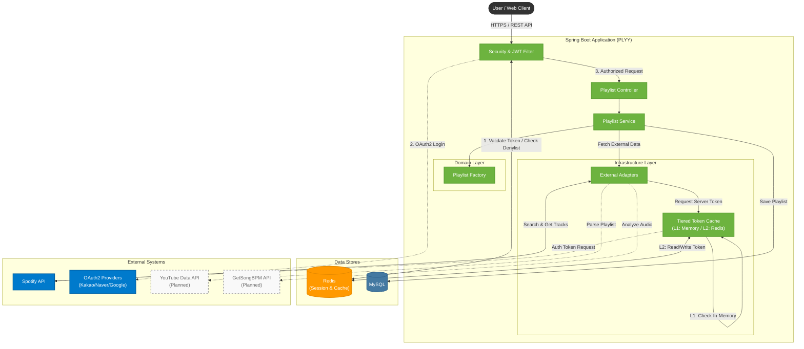
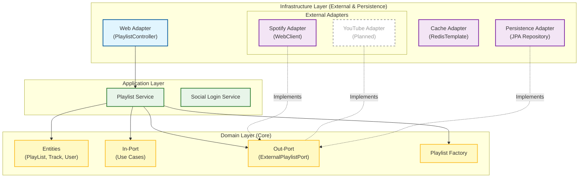
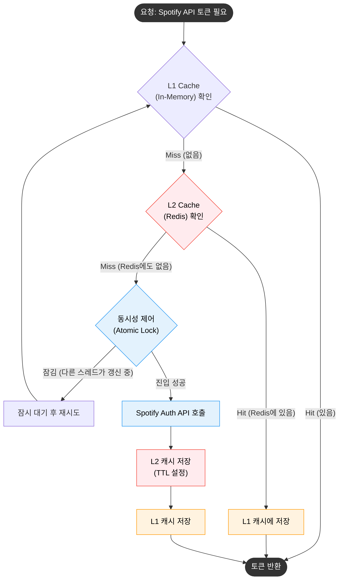
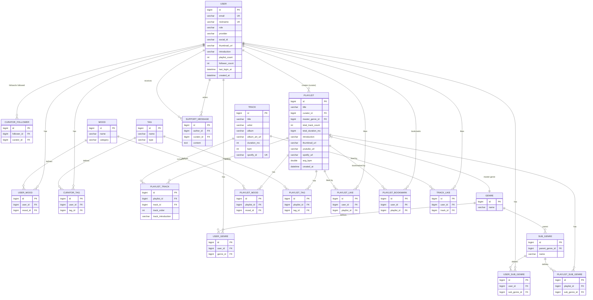
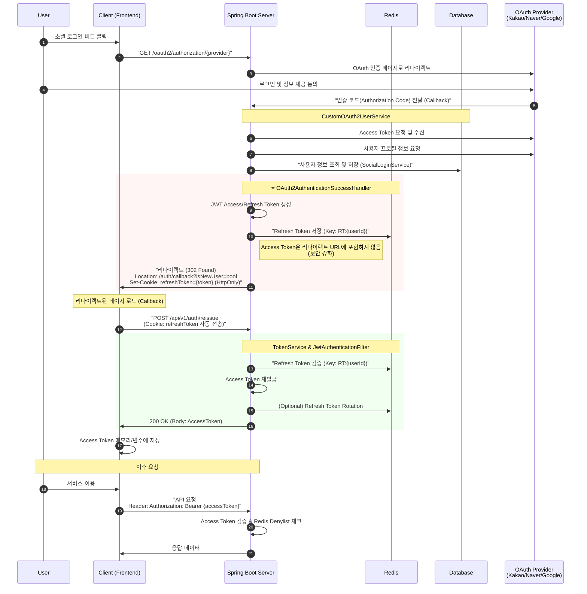
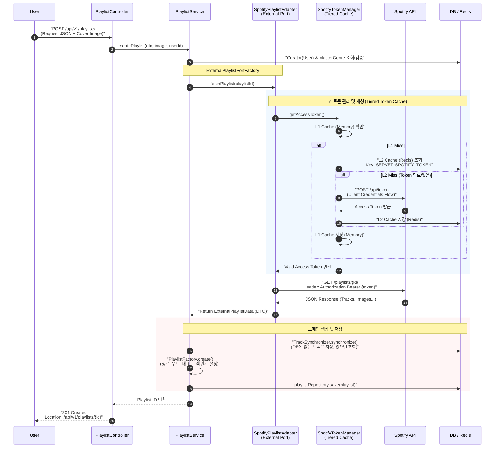

# PLYY - Human Curation Music Service

**"알고리즘이 놓친 숨은 명곡을 찾는 즐거움"**\
**PLYY**는 큐레이터가 직접 선별한 플레이리스트를 통해, **발견과 탐색부터 감상과 공유까지 편하고 즐거운** 음악 경험을 제공하는 큐레이션\
플랫폼입니다. PLYY는 이러한 가치를 바탕으로 큐레이터와 리스너를 연결하고, 청취 경험을 풍부하게 제공하는 것을 목표로 합니다.

---

## 1. 프로젝트 기획 의도

### 1.1 문제 인식

- **끝없는 스크롤과 의미 없는 추천의 피로감**
  AI 추천은 때로 사용자의 취향을 온전히 반영하지 못해, 원하는 음악을 찾기 위해 많은 시간을 소비하게 만듭니다.\
  또한, 맥락 없이 단순 나열된 곡 리스트는 음악에 대한 흥미를 반감시킵니다.

- **새로운 음악 발견의 어려움**  
  청취 이력에 기반한 반복적인 추천으로 인해 매번 비슷한 음악만 듣게 됩니다.  
  주류 차트 중심의 추천으로 인해 다양한 인디/마이너 장르의 숨겨진 명곡을 접하기 어렵습니다.

- **제한적인 공유와 소통**  
  타 음악 서비스 간의 연동이 어려워 좋은 플레이리스트를 친구들과 공유하기 불편합니다.  
  단순히 음악을 듣는 것을 넘어, 취향이 비슷한 사람들과 감상을 나누는 소통 창구 또한 부족합니다.

### 1.2 해결 방안:

- **음악의 발견과 탐색을 편하게(Curator)**\
  PLYY는 기계적인 알고리즘 대신, 큐레이터가 엄선한 플레이리스트를 중심으로\
  사용자의 선호 장르와 무드 데이터를 분석하여 결이 맞는 큐레이터를 추천할 계획이며
  탐색 과정을 간소화하고 새로운 음악 발견을 돕습니다.

- **깊이 있는 음악 경험(Curation)**  
  단순한 곡 리스트가 아닌, 큐레이터의 **코멘트**를 통해 곡의 선정 이유와 감상 포인트를 전달합니다.  
  리스너는 이를 통해 음악적 맥락을 이해하고, 자연스럽게 새로운 장르와 아티스트를 발견하고 음악에 더 몰입할 수 있습니다.

- **장벽 없는 공유와 소통(Community)**\
  누구나 접근 가능한 **YouTube 기반의 재생 환경 제공**을 목표로 하며 플랫폼 구독 여부와 상관없이 음악을 즐길 수 있습니다.
  더 나아가, 유연한 아키텍처 설계를 바탕으로 추후 **Spotify, Apple Music** 등 다양한 스트리밍 서비스와의 연동을 통해 끊김 없는 감상 경험 제공을 목표로 합니다.
  이러한 열린 환경 위에서 응원하기, 댓글, 팔로우 기능을 통해 큐레이터와 리스너가 **음악적 공감대**를 형성하는 커뮤니티를 만들어갑니다.

---
## 2. 주요 기능

### 2.1 구현 완료

| 구분 | 기능 설명 |
| :--- | :--- |
| **사용자 인증** | - 카카오, 네이버, 구글 소셜 로그인<br>- JWT + Redis 기반 토큰 관리<br>- Refresh Token Rotation<br>- 로그아웃 |
| **플레이리스트 등록** | - 스포티파이 링크를 통한 트랙 정보 자동 파싱<br>- 개별 트랙에 대한 큐레이션 코멘트 작성<br>- 마스터 장르, 서브 장르, 무드, 태그 분류<br>- Hexagonal Architecture 기반 확장 가능한 구조 |
| **캐싱 시스템** | - Spotify API 토큰 Tiered Cache (L1: Memory, L2: Redis)<br>- 동시성 제어를 통한 중복 API 호출 방지 |

### 2.2 개발 예정

| 구분 | 기능 설명 | 
| :--- | :--- |
| **사용자 온보딩** | - 선호 장르/무드 선택<br>- 큐레이터 추천 알고리즘 |
| **플레이리스트 탐색** | - 검색 기능 (키워드, 장르, 무드 필터)<br>- 정렬 및 페이지네이션 |
| **소셜 인터랙션** | - 좋아요/북마크<br>- 팔로우 시스템<br>- 댓글 및 응원 메시지 | 
| **통계 대시보드** | - 조회수, 유입 경로 분석<br>- 큐레이터 통계 제공 | 
| **추가 플랫폼 연동** | - YouTube 플레이리스트 파싱<br>- Apple Music 지원<br>- GetSongBPM API 연동 | 
| **개인화 추천** | - 사용자 맞춤 피드<br>- 이 주의 큐레이터/플레이리스트 | 
| **사용자 및 계정** | - 카카오, 네이버, 구글 소셜 로그인 지원<br>- 최초 가입 시 닉네임 설정 및 선호 장르, 무드 선택을 통한 취향 정보 수집<br>- 프로필 이미지, 닉네임, 한 줄 소개 관리<br>- 가입일 및 활동 내역(좋아요, 북마크) 확인<br>- 회원 탈퇴 |
| **플레이리스트 및 큐레이션<br>(핵심)** | - 유튜브, 스포티파이 링크를 이용한 트랙 정보 자동 파싱 및 **등록/수정/삭제**<br>- **개별 트랙에 대한 큐레이션(코멘트)** 작성 기능 제공<br>- 마스터 장르, 서브 장르, 무드, 태그 설정을 통한 세분화된 분류<br>- 플레이리스트 좋아요, 북마크, 댓글 작성/수정/삭제 기능 |
| **큐레이터 및 커뮤니티** | - 플레이리스트 발행 목록 및 기간별/유형별 상세 통계(**유입 경로**, 조회수 등)<br>- 팔로우/언팔로우 시스템<br>- 큐레이터 응원글(방명록) 작성 및 답글 소통 기능<br>- 내 활동 및 팔로우한 큐레이터 신규 플레이리스트 알림 |
| **발견 및 홈** | - 사용자 선호 장르/무드 및 활동 이력 기반 맞춤 추천<br>- 메인 화면 ‘이 주의 큐레이터’, ‘이 주의 플레이리스트’ 소개<br>- 플레이리스트, 큐레이터, 태그, 장르 통합 검색 및 추천 태그, 최근 검색어 저장 |
| **외부 API 연동** | - 유튜브 및 스포티파이 재생목록 링크 파싱 및 곡 정보 동기화<br>- GetSongBPM API를 활용한 곡 BPM 데이터 확보 및 분석<br>- 곡 상세 화면에서 유튜브 및 스포티파이 바로가기 링크 제공 (**캐싱 적용**) |
 
---
## 3. System Architecture

**PLYY**는 안정적인 서비스 제공과 유지보수성을 위해 **Hexagonal Architecture**와 **Tiered Caching Strategy**를 채택하여 설계되었습니다.

### 3.1 전체 시스템 구조 (System Architecture)

Client는 REST API를 통해 Spring Boot 서버와 통신하며, 보안을 위해 **JWT**와 **Redis** 기반의 인증 시스템을 사용합니다.



---
### 3.2 핵심 기술적 의사결정 (Technical Decisions)

#### 🔹 Hexagonal Architecture (Ports & Adapters)

**채택 배경**

음악 메타데이터 소스가 다양하고(Spotify, YouTube 등), 향후 확장 가능성이 높은 서비스 특성상 외부 시스템 변경 시 핵심 로직 수정을 최소화하기 위해 격리했습니다.

**구현 전략**
- **Port (Interface)**: `ExternalPlaylistPort` 인터페이스를 정의하여 도메인 영역에서 외부 시스템을 몰라도 기능을 수행할 수 있도록 추상화
- **Adapter (Implementation)**: `SpotifyPlaylistAdapter`와 같이 각 외부 API에 맞는 구체적인 통신 로직을 인프라 계층에 격리
- **Dynamic Selection (Factory Pattern)**: `ExternalPlaylistPortFactory`를 구현하여, 입력된 링크(Source)에 따라 런타임에 적절한 어댑터를 동적으로 주입받도록 설계

**기대 효과**
- **유지보수성 향상**: Spotify API 명세가 변경되더라도 어댑터 내부만 수정하면 되며, 도메인(PlaylistService) 로직은 영향을 받지 않음
- **확장 가능성**: 추후 Apple Music 등의 플랫폼 추가 시, 기존 코드 수정 없이 새 어댑터 클래스만 추가하여 확장 가능
- **테스트 용이성**: 외부 API 통신 없이 Mock Adapter를 사용하여 도메인 로직만 독립적으로 테스트 가능


    * 현재는 Spotify만 구현됨

#### 🔹 Tiered Token Caching (L1 + L2 Strategy)

**문제 상황**
Spotify API는 **Client Credentials Flow**를 통해 서버 토큰을 발급받아야 하며, 다음과 같은 제약사항이 있습니다:
- **Rate Limiting**: 초당 요청 수 제한 존재 (약 180 requests/min)
- **Token 수명**: 1시간 후 만료되며, 매번 재발급 시 불필요한 네트워크 I/O 발생
- **동시 요청**: 여러 사용자가 동시에 플레이리스트를 생성할 경우 중복 토큰 발급 요청 발생

**해결 방안: 2단계 캐싱 및 동시성 제어**

1. **L1 Cache (In-Memory)**
    - `ConcurrentHashMap`을 사용한 애플리케이션 로컬 캐싱
    - 네트워크 I/O 없이 빠른 응답 제공
    - 가장 빈번한 요청을 처리하여 Redis 부하 감소

2. **L2 Cache (Redis)**
    - 분산 환경을 고려하여 공유 캐시로 사용
    - **TTL(Time-To-Live) 설정**: Spotify 토큰 만료 시간(3600초)보다 짧게 설정하여(예: 3500초) 만료 전에 갱신 유도
    - 애플리케이션 재시작 시에도 토큰 정보 유지

3. **Atomic Request Lock (동시성 제어)**
    - `AtomicBoolean`을 활용한 락(Lock) 메커니즘 적용
    - 토큰 만료 시, 동시 다발적인 갱신 요청이 들어와도 **단 하나의 스레드만** API를 호출하도록 제어
    - 나머지 요청은 대기 후 갱신된 토큰 사용

**기대 효과**
- **외부 API 호출 횟수 감소**
- **캐시를 통한 응답 속도 개선**
- **서버 재시작 시에도 토큰 재사용 가능**



---
## 4. Database Schema (ERD)

### 4.1 설계 철학

PLYY의 데이터베이스는 데이터 무결성과 조회 성능의 균형을 맞추기 위해 다음 원칙을 따랐습니다.

1.  **정규화와 반정규화의 균형**: 기본적으로 3NF를 준수하여 데이터 중복을 제거하되, 빈번한 조회가 발생하는 통계 정보(`total_track_count`, `avg_bpm`, `playlist_count` 등)는 **반정규화(Denormalization)**하여 조인 연산을 줄이고 조회 성능 최적화
2.  **데이터 무결성 및 생명주기 관리**: 모든 관계 테이블(`_like`, `_tag` 등)에 `ON DELETE CASCADE` 제약조건을 설정하여 참조 무결성 유지
3.  **확장 가능한 메타데이터 구조**: 장르, 무드, 태그 등 확장 가능성이 높은 데이터는 별도 엔티티로 분리

### 4.2 주요 테이블 및 역할

**User & Preferences (취향 분석)**
- **`user`**: 사용자 기본 정보 및 소셜 로그인 식별자(`social_id`) 저장
- **`user_genre` / `user_mood`**: 사용자의 선호 취향을 저장하는 매핑 테이블. **다중 선택이 가능한 N:M 관계**를 해소하며, 추후 큐레이터 추천 기능에 활용 예정

**Playlist & Storytelling (휴먼 큐레이션)**
- **`playlist`**: 플레이리스트의 메타데이터 저장. `master_genre_id`를 통해 대분류 지정 및 `avg_bpm` 등으로 오디오 특성 추출
- **`playlist_track`**: 단순 매핑 테이블을 넘어 **큐레이션의 핵심** 역할 수행
    - `track_introduction`: 큐레이터가 작성한 **곡별 코멘트** 저장
    - `track_order`: 플레이리스트 내 재생 순서 보장

**Track & Meta (음원 정보)**
- **`track`**: `spotify_id`를 유니크 키로 사용하여 중복 저장 방지 및 외부 플랫폼과의 데이터 동기화 기준점이 됨
- **`genre` / `sub_genre`**: 'Pop > K-Pop'과 같은 **계층형 구조** 설계

**Interaction & Logs (활동 및 통계)**
- **`playlist_view_log`**: 단순 조회수 증가뿐만 아니라 **유입 경로`inflow_type`**를 기록하여, 큐레이터에게 상세한 유입 경로(검색/추천 등) 기반 통계 제공 예정
- **`playlist_like` / `playlist_bookmark`**: 사용자 인터랙션 기록 및 `Unique Constraint`를 통해 중복 좋아요 방지

### 4.3 ERD 다이어그램



### 4.4 인덱싱 전략

**조회 성능 최적화를 위한 인덱스**

- `user.email`, `user.nickname`: 로그인 및 중복 검사 (UNIQUE INDEX)
- `track.spotify_id`: 외부 API 데이터 동기화 시 중복 방지 (UNIQUE INDEX)
- `playlist.curator_id`: 큐레이터별 플레이리스트 조회 (일반 INDEX)
- `playlist_view_log.playlist_id`, `playlist_view_log.created_at`: 인기 플레이리스트 집계 (복합 INDEX)

**복합 유니크 제약**

- `(user_id, playlist_id)`: 좋아요/북마크 중복 방지
- `(follower_id, curator_id)`: 팔로우 중복 방지
- `(user_id, genre_id)`, `(user_id, mood_id)`: 사용자 선호도 중복 방지

---

## 5. Core Process Flows

#### 5.1 OAuth2 & JWT Authentication

**인증 전략 (Auth Strategy): JWT + Redis**

1. **Stateless와 Stateful의 조화**
    - **Access Token (Stateless)**: 서버에 세션 정보를 저장하지 않고, 토큰의 서명만 확인하여 데이터베이스 접근 없이 인증 처리
    - **Refresh Token (Stateful)**: Redis에 저장하고 관리함으로써, 토큰 탈취 시 **강제 로그아웃(Revoke)** 및 **토큰 무효화** 가능

2. **보안 강화 (Security Hardening)**
    - **Access Token**: Authorization Header로 전달하여 XSS 공격 위험을 줄이고, **RTR(Refresh Token Rotation)**을 통해 탈취된 토큰 사용 시간 제한
    - **Refresh Token**: JavaScript로 접근 불가능한 **HttpOnly Cookie**에 저장하여 XSS 공격 방어

3. **Refresh Token Rotation (RTR)**
    - Access Token 재발급(Reissue) 요청 시마다, 기존 Refresh Token을 폐기하고 **새로운 토큰 발급**
    - 이를 통해 Refresh Token이 탈취되더라도, 공격자가 사용하기 전에 토큰이 교체되어 피해를 최소화하도록 설계

4. **Logout Handling (Denylist)**
    - 로그아웃 시 유효기간이 남은 Access Token을 **Redis Denylist**에 등록 (Key: `BL:{token}`, TTL: 남은 유효시간)
    - `JwtAuthenticationFilter`에서 모든 요청에 대해 Denylist 여부를 먼저 확인하여, 로그아웃된 토큰의 재사용 차단

**주요 보안 정책 (Security Policies)**
- **CORS**: `AllowCredentials=true` 및 화이트리스트 기반의 엄격한 Origin 검증
- **Cookie Policy**: `HttpOnly`, `Secure` (Prod), `SameSite=Lax/Strict` 설정을 통한 쿠키 보안
- **Abnormal Detection**: 보관된 Refresh Token과 요청된 토큰이 일치하지 않을 경우(탈취 의심), 즉시 해당 사용자의 **저장된 토큰 삭제** 후 재로그인 유도

#### 인증 프로세스 상세 플로우



### 5.2 Playlist Registration Flow (Case Study: Spotify Integration)

#### 기능 목표

사용자가 Spotify 플레이리스트 링크를 입력하면 (YouTube 지원 예정), 다음과 과정을 통해 PLYY 서비스에 등록됩니다.
1. **Metadata Extraction**: 외부 API를 통해 트랙 목록, 썸네일, 앨범 정보 등을 추출
2. **Smart Synchronization**: DB에 없는 트랙은 신규 생성하고, 이미 존재하는 트랙은 재사용하여 중복 방지
3. **Human Curation Mapping**: 큐레이터가 작성한 코멘트와 태그, 장르 정보를 결합하여 최종 플레이리스트 생성

#### 전체 프로세스 시퀀스



#### 구현 상세

**5.1 Track Synchronization (중복 방지 및 동기화)**
`TrackSynchronizer`는 외부에서 가져온 트랙 리스트를 DB와 대조하여 저장합니다.

```java
public List<Track> synchronize(List<ExternalTrackData> externalTracks, PlaylistSource source) {
    // 1. 외부 트랙들의 식별자(Spotify ID) 추출
    Set<String> spotifyIds = externalTracks.stream()
            .map(ExternalTrackData::externalId)
            .collect(Collectors.toSet());

    // 2. DB에 이미 존재하는 트랙 조회 (Batch 조회로 N+1 문제 방지)
    Map<String, Track> existingMap = trackRepository.findAllBySpotifyIdIn(spotifyIds)
            .stream()
            .collect(Collectors.toMap(Track::getSpotifyId, Function.identity()));

    // 3. 존재하지 않는 트랙만 필터링하여 신규 엔티티 생성
    List<Track> newTracks = externalTracks.stream()
            .filter(ext -> !existingMap.containsKey(ext.externalId()))
            .map(this::toTrackEntity)
            .toList();

    // 4. 신규 트랙 Batch Insert (Bulk 연산)
    if (!newTracks.isEmpty()) {
        trackRepository.saveAll(newTracks);
    }

    // 5. 기존 트랙과 신규 트랙을 원본 순서대로 병합하여 반환
    return mergeTracksPreservingOrder(externalTracks, existingMap, newTracks);
}
```

**5.2  Playlist Factory (도메인 객체 생성 캡슐화)**

복잡한 연관관계 설정(장르, 무드, 태그, 트랙 순서, 큐레이션 멘트) 책임을 Factory로 위임하여 서비스 계층의 코드를 간소화했습니다.

```java
public PlayList create(PlaylistCreateRequest request, User curator, List<Track> tracks) {
    // 1. 기본 엔티티 생성 (Builder 패턴)
    PlayList playlist = PlayList.builder()
            .title(request.title())
            .curator(curator)
            .masterGenre(findMasterGenre(request.masterGenreId()))
            .introduction(request.introduction())
            .build();

    // 2. 큐레이션 멘트 매핑 (Track Index 기준)
    Map<Integer, String> curationMap = request.trackCurations().stream()
            .collect(Collectors.toMap(
                    TrackCurationRequest::trackIndex,
                    TrackCurationRequest::introduction
            ));

    // 3. 연관관계 설정 (트랙 순서 및 코멘트 포함)
    for (int i = 0; i < tracks.size(); i++) {
        int order = i + 1;
        String comment = curationMap.getOrDefault(order, null); // 해당 순서의 코멘트 조회
        
        playlist.addTrack(tracks.get(i), order, comment);
    }

    // 4. 메타데이터(태그, 무드) 연결
    attachMoods(playlist, request.moodIds());
    attachTags(playlist, request.tags());

    return playlist;
}
```

#### 기술적 고려사항
데이터 일관성과 성능을 고려하여 다음과 같은 전략을 적용했습니다.
**데이터 일관성 보장**
- **`@Transactional` 범위 설정**: 데이터의 일관성이 중요한 saveAll(트랙 저장)과 save(플레이리스트 저장) 과정을 하나의 트랙잭션으로 묶어, 중간에 실패 시 전체 롤백되도록 보장
- **외부 API 분리**: 트랜잭션 시작 전 또는 비동기 처리를 통해 외부 API 호출을 트랜잭션 밖으로 분리 예정

**성능 최적화**
- **Batch Processing**: `trackRepository.saveAll()`을 사용하여 수십 개의 트랙 정보를 한 번의 쿼리(Batch Insert)로 처리함
- **Bulk Fetching**: 트랙 조회 시 `IN` 절을 활용한 Bulk 조회로 N+1 문제 방지
- **Non-blocking I/O**: 외부 API 통신에 `WebClient`를 사용하여, 비동기 방식으로 처리

---

## 6. 구현된 API 명세

PLYY의 API는 RESTful 원칙을 준수합니다.

### 6.1 인증 (Authentication)

JWT 기반의 인증/인가를 담당하며, 보안을 위해 Access Token 재발급과 로그아웃 기능을 제공합니다.

| Method | URI | Description | Note |
| :---: | :--- | :--- | :--- |
| `POST` | `/api/v1/auth/reissue` | **토큰 재발급** | Refresh Token(Cookie) 필수 |
| `POST` | `/api/v1/auth/logout` | **로그아웃** | Access Token Denylist 등록 |

<details>
<summary> <b>Access Token 재발급</b></summary>

```http
POST /api/v1/auth/reissue
Cookie: refreshToken={token}

Response 200 OK
{
  "accessToken": "eyJhbGciOiJIUzI1NiIsInR5cCI6IkpXVCJ9..."
}
```
</details>

<details>
<summary> <b>로그아웃</b></summary>

```http
POST /api/v1/auth/logout
Authorization: Bearer {accessToken}
Cookie: refreshToken={token}

Response 200 OK
{
  "message": "로그아웃되었습니다."
}
```
</details>

### 6.2 플레이리스트 (Playlist)
외부 링크 파싱, 이미지 업로드, 메타데이터 설정을 포함한 플레이리스트 생성 API입니다.

| Method | URI | Description | Note |
| :---: | :--- | :--- | :--- |
| `POST` | `/api/v1/playlists` | **플레이리스트 생성** | multipart/form-data |

<details>
<summary> <b>플레이리스트 생성</b></summary>

```http
POST /api/v1/playlists
Authorization: Bearer {accessToken}
Content-Type: multipart/form-data

Form Data:
- request (JSON):
  {
    "source": "spotify",
    "playlistUrl": "https://open.spotify.com/playlist/...",
    "title": "털ㄴ업 힙합",
    "introduction": "흥 MAX 찍는 힙합 모음",
    "masterGenreId": 9,
    "subGenreIds": [13],
    "moodIds": [10, 11],
    "tags": ["힙합", "외힙", "털ㄴ업"],
    "trackCurations": [
      {
        "trackIndex": 0,
        "introduction": "분위기 가열 시작송"
      }
    ]
  }
- coverImage (File): 플레이리스트 커버 이미지

Response 201 Created
Location: /api/v1/playlists/{playlistId}
```
</details>

### 6.3 장르 (Genre)

| Method | URI | Description |
| :---: | :--- | :--- | 
| `GET` | `/api/v1/genres/master` | **마스터 장르 목록 조회** |
| `GET` | `/api/v1/genres/{masterGenreId}/sub-genres` | **하위 장르 목록 조회** |

<details>
<summary> <b>마스터 장르 목록 조회</b></summary>

```http
GET /api/v1/genres/master

Response 200 OK
[
  {
    "id": 1,
    "name": "Pop"
  },
  {
    "id": 2,
    "name": "K-Pop"
  }
]
```
</details>

<details>
<summary> <b>서브 장르 목록 조회</b></summary>

```http
GET /api/v1/genres/{masterGenreId}/sub-genres

Response 200 OK
[
  {
    "id": 2,
    "name": "Dance (댄스)"
  },
  {
    "id": 2,
    "name": "Hip-hop (힙합)"
  }
]
```
</details>
---

## 7. 기술 스택 및 개발 환경

### Backend
- **Language**: Java 21 (LTS)
- **Framework**: Spring Boot 3.5.7
    - Spring Web / Spring WebFlux (Client)
    - Spring Security 6.x
    - Spring Data JPA
    - Spring OAuth2 Client
- **Build Tool**: Gradle 8.x
- **Database**: MySQL 8.0
- **Cache**: Redis (Jedis Client)
- **ORM**: Hibernate 6.x, QueryDSL 5.0
- **Migration**: Flyway

### Infrastructure
- **Deployment**: Docker
- **Monitoring**: Spring Actuator, P6Spy (Query Log)

### External APIs
- **Spotify Web API**: Track metadata, audio features (via WebClient)
- **OAuth2 Providers**: Kakao, Google, Naver
- **Firebase Cloud Messaging (FCM)**: Push notifications

### Development Tools
- **IDE**: IntelliJ IDEA
- **API Testing**: Postman
- **Database Tool**: MySQL Workbench
- **Version Control**: Git, GitHub

---

## 8. 프로젝트 실행 방법

<details>
<summary><b>상세 설정 및 실행 방법 확인하기</b></summary>

### 1. 사전 요구사항 (Prerequisites)
- **Java 21**, **Docker & Docker Compose**, **MySQL 8.0**

### 2. 환경 설정 파일 구성 (Configuration)
`src/main/resources` 경로에 아래 4개의 `*.yml`파일을 직접 생성해야 프로젝트가 정상 동작합니다.

① application.yml
프로젝트의 진입점 설정입니다.
```yaml
spring:
  application:
    name: plyy
  profiles:
    active: local
    include: social, jwt
  data:
    redis:
      host: localhost
      port: 6379
```

② application-local.yml
로컬 개발 환경의 DB, CORS, 로깅 설정입니다. DB 계정 정보(username, password)를 본인 환경에 맞게 수정하세요.
```yaml
app:
  cors:
    allowed-origins:
      - http://localhost:3000
      - http://127.0.0.1:3000
spring:
  datasource:
    driver-class-name: com.mysql.cj.jdbc.Driver
    url: jdbc:mysql://localhost:3306/plyy_db?useSSL=false&serverTimezone=Asia/Seoul&allowPublicKeyRetrieval=true
    username: root
    password: 1234
  jpa:
    hibernate:
      ddl-auto: validate
    show-sql: true
    properties:
      hibernate:
        format_sql: true
  flyway:
    enabled: true
    locations: classpath:db/migration
  logging:
    level:
      com.plyy.plyyReboot.config.security: DEBUG
      org.springframework.security: DEBUG
      p6spy: INFO
```

③ application-social.yml
소셜 로그인 및 외부 API 연동 설정입니다.

```yaml
spring:
  security:
    oauth2:
      client:
        registration:
          kakao:
            client-id: ${KAKAO_CLIENT_ID}
            client-secret: ${KAKAO_CLIENT_SECRET}
            client-authentication-method: client_secret_post
            authorization-grant-type: authorization_code
            redirect-uri: "{baseUrl}/login/oauth2/code/{registrationId}"
            scope: account_email
            client-name: Kakao
          google:
            client-id: ${GOOGLE_CLIENT_ID}
            client-secret: ${GOOGLE_CLIENT_SECRET}
            scope: email, profile
            redirect-uri: "{baseUrl}/login/oauth2/code/{registrationId}"
          naver:
            client-id: ${NAVER_CLIENT_ID}
            client-secret: ${NAVER_CLIENT_SECRET}
            authorization-grant-type: authorization_code
            redirect-uri: "{baseUrl}/login/oauth2/code/{registrationId}"
            scope: name, email, profile_image
            client-name: Naver
        
        provider:
          kakao:
            authorization-uri: https://kauth.kakao.com/oauth/authorize
            token-uri: https://kauth.kakao.com/oauth/token
            user-info-uri: https://kapi.kakao.com/v2/user/me
            user-name-attribute: id
          naver:
            authorization-uri: https://nid.naver.com/oauth2.0/authorize
            token-uri: https://nid.naver.com/oauth2.0/token
            user-info-uri: https://openapi.naver.com/v1/nid/me
            user-name-attribute: response

spotify:
  api:
    url: "https://api.spotify.com/v1"
    auth-url: "https://accounts.spotify.com/api/token"
  client-id: ${SPOTIFY_CLIENT_ID}
  client-secret: ${SPOTIFY_CLIENT_SECRET}
```

④ application-jwt.yml
JWT 토큰 보안 설정입니다.
```yaml
spring:
  jwt:
    secret: "${JWT_SECRET_KEY}" # Base64 인코딩된 긴 문자열
    access-token-expiration-ms: 86400000
    refresh-token-expiration-ms: 604800000
    cookie-name: accessToken
    issuer: plyy-api
```

### 3\. 실행 (Run)

```bash
# 인프라 실행 (MySQL, Redis)
docker-compose up -d

# 애플리케이션 실행
./gradlew bootRun
```
</details\>